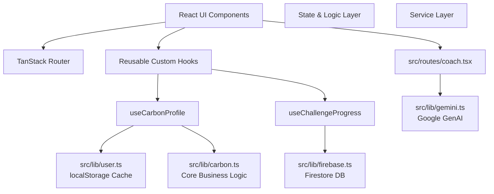

# Vasudha — Personal Eco Companion

Vasudha is an interactive, gamified sustainability app designed to help users track their carbon footprint, learn eco-friendly habits, and watch their personal "Earth" heal in real-time. Built with a focus on Indian lifestyle contexts, the app includes bilingual support (English/Hindi), interactive SVG animations, and a Gemini-powered Eco Coach.

---

## 🏗 Architecture

### Key Libraries & Folders
- **`src/lib/carbon.ts`**: The core business logic containing pure functions for calculating the Vasudha Health Index and running the Future Earth Simulator.
- **`src/lib/firebase.ts`**: The database service layer. Handles all Firestore interactions for saving profiles, history snapshots, and challenge progress. Gracefully degrades if misconfigured.
- **`src/lib/gemini.ts`**: The AI service layer powering the Eco Coach.
- **`src/lib/user.ts`**: Local caching and guest identity management.
- **`src/hooks/`**: Reusable React hooks (`useCarbonProfile`, `useChallengeProgress`) encapsulating state and async operations to keep components clean.
- **`src/routes/`**: Page-level components managed by TanStack Router.
- **`src/components/`**: Reusable UI elements including the `AppShell`, `ErrorBoundary`, and onboarding cards.

## 🔐 Environment Variables

Create a `.env` file based on `.env.example`. The app uses the following variables:

| Variable | Description |
|---|---|
| `VITE_FIREBASE_API_KEY` | Firebase project API key |
| `VITE_FIREBASE_AUTH_DOMAIN` | Firebase auth domain |
| `VITE_FIREBASE_PROJECT_ID` | Firebase project ID |
| `VITE_FIREBASE_STORAGE_BUCKET`| Firebase storage bucket |
| `VITE_FIREBASE_MESSAGING_SENDER_ID`| Firebase messaging sender ID |
| `VITE_FIREBASE_APP_ID` | Firebase app ID |
| `VITE_GEMINI_API_KEY` | Google Generative AI key for Eco Coach |

> **Note**: If Firebase variables are missing, the app continues to function in "offline" mode using `localStorage`. If the Gemini key is missing, the Eco Coach page gracefully alerts the user.

## ♿ Accessibility (WCAG 2.1 AA)
Vasudha implements key accessibility features including:
- **`aria-live` regions**: Screen readers announce route changes, simulation metrics, and challenge badges dynamically.
- **Reduced Motion**: Respects the `prefers-reduced-motion: reduce` OS preference by disabling decorative animations.
- **Focus Management**: The "Learn" modal traps focus within its boundaries and supports `Escape` to close.
- **Skip Links**: A hidden "Skip to main content" link is available for keyboard users.
